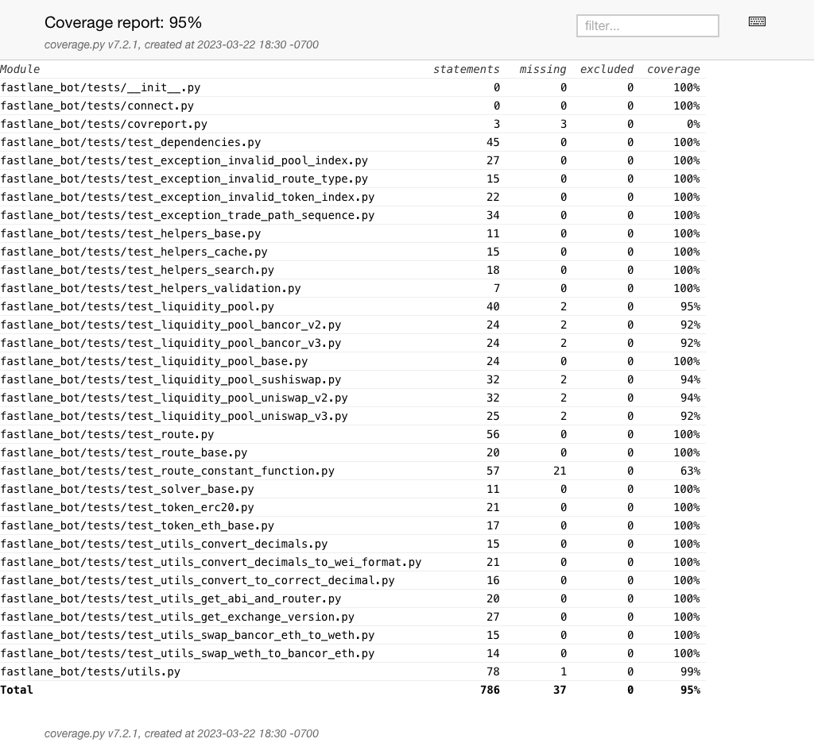

* * * * * * * * * * * * * * * * * * * * * * * * * * * * * * * * * * * * * * * * * * * * * * * * * * * * * * * *
# Fast Lane
* * * * * * * * * * * * * * * * * * * * * * * * * * * * * * * * * * * * * * * * * * * * * * * * * * * * * * * *

**Warning**

_The Fast Lane is in beta.  We cannot be held responsible for any losses caused by use of this code._

* * * * * * * * * * * * * * * * * * * * * * * * * * * * * * * * * * * * * * * * * * * * * * * * * * * * * * * *


## About Fast Lane

The Fast Lane is a tool developed to find and close arbitrage opportunities that occur on Bancor exchanges. This serves to increase market efficiency by ensuring Bancor liquidity is trading at rates similar to the rest of the market.

The permanent URL for this repo is [https://github.com/bancorprotocol/fastlane-bot](https://github.com/bancorprotocol/fastlane-bot).

## Getting started

Before using the Fast Lane, it is *__HIGHLY__* recommended to set up a new Ethereum wallet dedicated exclusively to running the bot. The wallet will need ETH for gas fees. Because the project requires the wallet's private key, extreme caution should be exercised.

Running the Fast Lane requires the ability to read and write to Ethereum. It is preconfigured to use Alchemy, and requires an Alchemy API key to make network requests.
* [Alchemy](https://www.alchemy.com/)

### Project Setup
Create a file named *.env,* and add the Alchemy API key, and your __new__ wallet's private key using the format provided in *.env.example*, in the main `fastlane_bot` project folder.

### Configurable Options
The Fast Lane can be configured to search only for specific exchanges or tokens. These are configured in `run.py`, in the `@click.option` section. 

* __Exchanges:__ To change exchanges, edit the `exchanges` variable, and include/exclude exchange names (found in constants.py), separated by dashes. For example: `@click.option("--tokens", default=f"{ec.BANCOR_V3_NAME}-{ec.UNISWAP_V2_NAME}", type=str)`
* __Tokens:__ To change tokens, edit the `tokens` variable, and include/exclude a string of tokens, separated by dashes. For example: `@click.option("--tokens", default=f"LINK-ETH-WBTC", type=str)`

### Method 1. Quick setup

Navigate to the top level project directory and run:

````{tab} PyPI
$ pip install -r requirements.txt
````

Then, from the same directory run:

````{tab} PyPI
$ python run.py
````

If you get import errors or a `ModuleNotFound` exception, try:

````{tab} PyPI
$ python your-local-absolute-path/run.py
````

If you hit Brownie related errors, skip to the section below titled `Brownie Troubleshooting`, then come back and attempt Method 1 again after you've confirmed Brownie is setup on your system.

The upside of Method 1 is that you get started quickly and easily. The downside is that the `fastlane_bot` library may only work for notebooks and scripts located in the root directory of this project.

### Method 2. Installation

This method will install the `fastlane_bot` package as well as all its dependencies on your system. We highly recommend to do this [in a virtual environment][venv], in which case no permanent changes will be made. To install the `fastlane_bot` library, navigate to the top level project directory, and run the installation process via:

````{tab} PyPI
$ python setup.py install
````

Then try running the following command:
````{tab} PyPI
$ python run.py
````

As the `fastlane_bot` library is now installed on your system, you can run the code from anywhere whilst the virtual environment is active.

#### Brownie Troubleshooting

The Fast Lane uses Brownie with Alchemy for some Ethereum network calls. The software is setup to automatically connect to Brownie, however, in the event that you need to manually configure Brownie, follow the steps below:

To configure Brownie with Alchemy, open a terminal in the main project folder, and execute the following commands:

1: `brownie networks update_provider alchemy https://eth-{}.alchemyapi.io/v2/$WEB3_ALCHEMY_PROJECT_ID`

2: `brownie networks modify mainnet provider=alchemy`

3: `brownie networks set_provider alchemy`

If you receive the error: ValueError: Unable to expand environment variable in host setting: `https:// mainnet.infura.io/v3/$WEB3_INFURA_PROJECT_ID`, try repeating the previous steps, and check [Brownie documentation](https://eth-brownie.readthedocs.io/en/stable/install.html).

# Branches and versioning

## 
This repo contains two key branches, `main`, and `dev`. Their respective properties are as follows:

- `main`. The main branch is the main release branch of this project. It may not contain all bleeding edge features, but it has been tested thoroughly (but see the disclaimer on top).

- `dev`. The dev branch contains the latest features. The test suit will not usually run before pushing to dev, so this branch may be broken.

## Versioning

We attempt to use [semantic versioning][semver] (`major.minor.patch`), so the major number is changed on backward incompatible API changes, the minor number on compatible changes, and the patch number for minor patches.

[semver]:https://semver.org/

# Change log

- **v1.0** - initial release

# Coverage:


